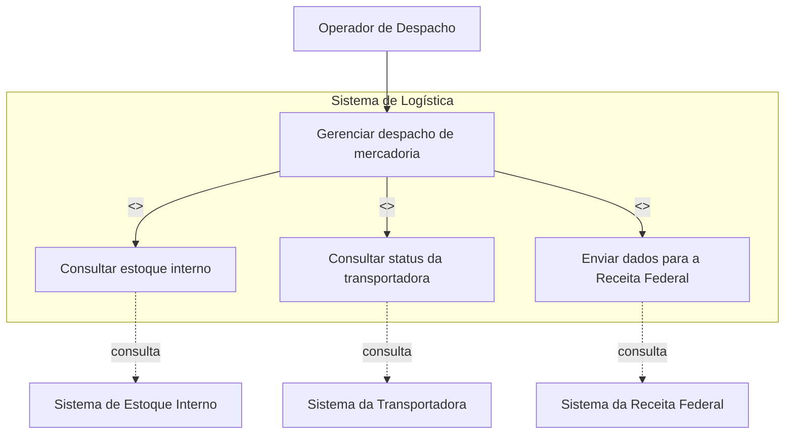
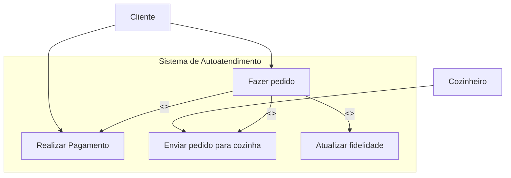
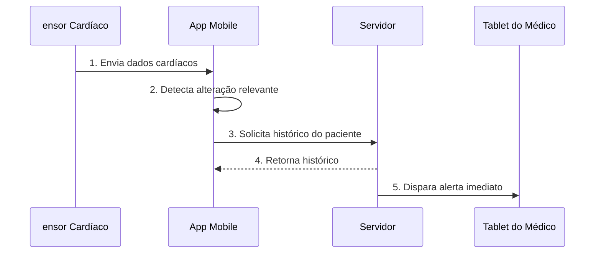
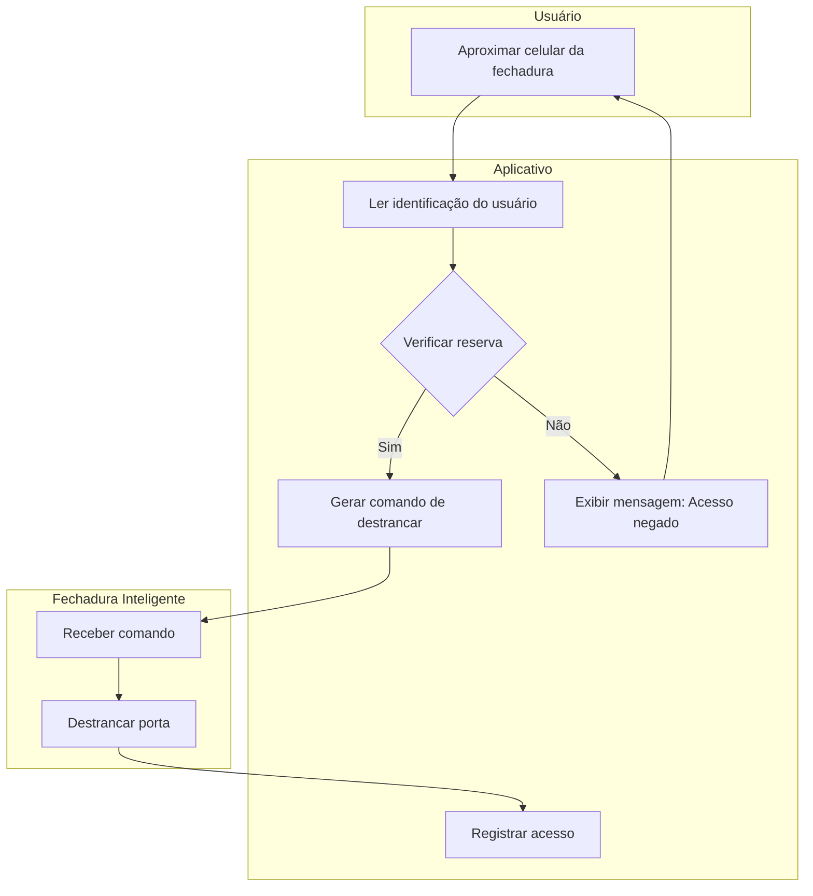
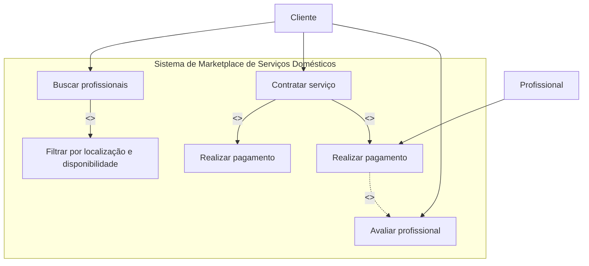

# Cenário 1: Logística de E-commerce Global

---
# Cenário 2: Totem de Autoatendimento em Fast-Food

---
# Cenário 3: Sistema de Telemedicina (Monitoramento)

---
# Cenário 4: Sistema de Controle de Acesso Inteligente

---
# Cenário 5: Marketplace de Serviços Domésticos

